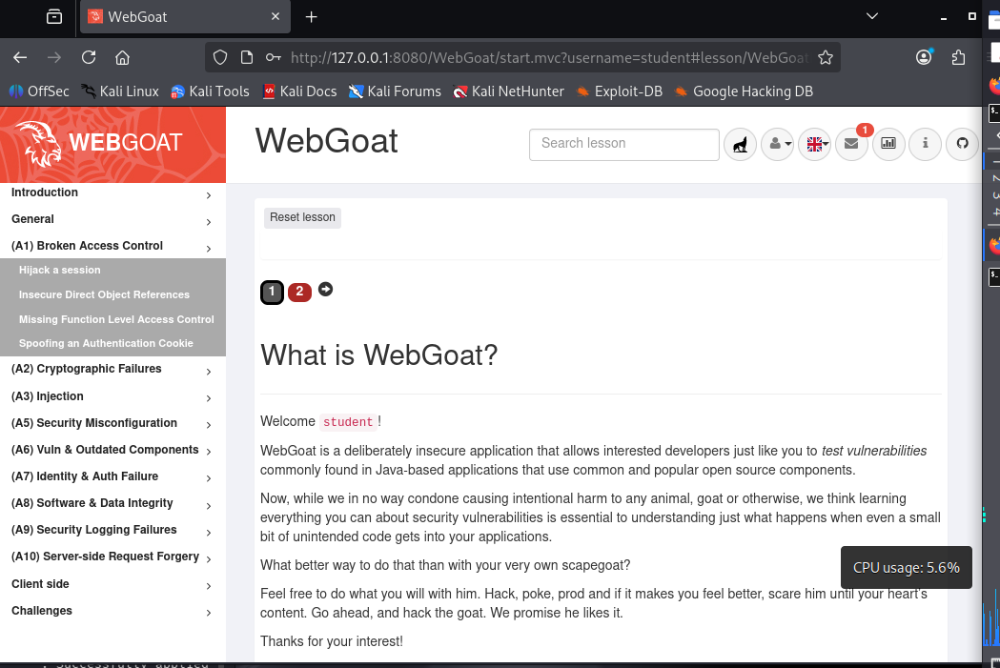

# Мета: Знайомство з A01:2025 Broken Access Control

## Середовище: Kali Linux, Docker engine, OWASP WebGoat container.

### Launch webgoat from docker container

### WebGoat is online

### Task is DONE ( I forget to take a screenshots of my previous steps, sorry)

