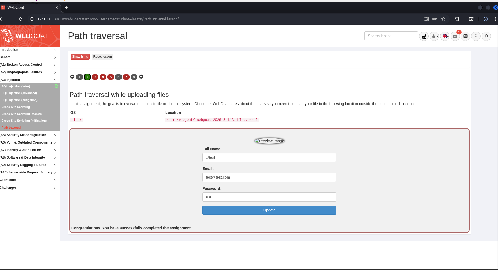
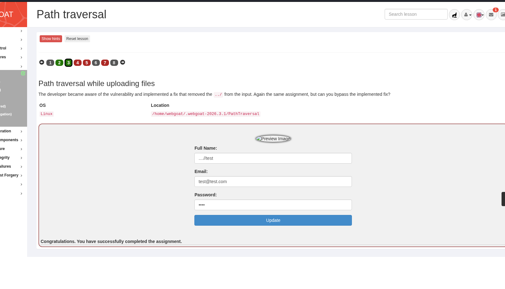
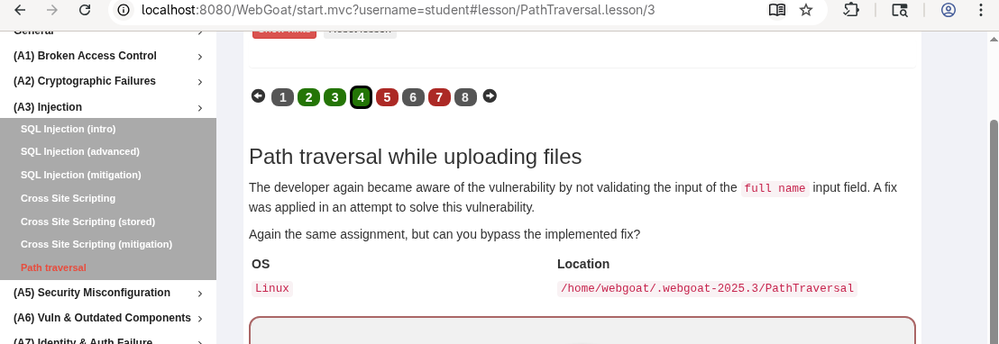

# PathTraversal 

# Task 2

# Task 3

# Task 4

# Task 5
Очень долго пыхтел над таской, но так и не понял, что я делаю не так. Всё что смог получить: ответ от сервера с payload'ом и попробовал ещё на хосте установить сам файл с помощью кёрла, но после скачивания файл не открывался:(
